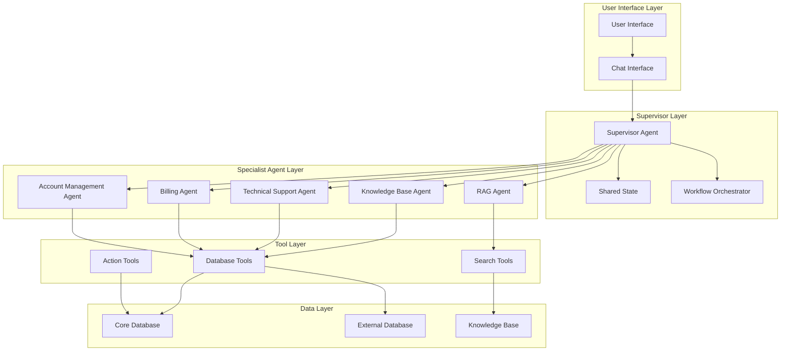

# Multi-Agent Architecture Design Document

## Overview

This document outlines the comprehensive multi-agent architecture for the Uda-hub agentic system, designed to provide intelligent customer support for CultPass users. The system employs a **Supervisor Pattern** with specialized agents working under the coordination of a central supervisor agent.

## Architecture Pattern

**Pattern**: Supervisor Pattern with Network Communication
- **Supervisor Agent**: Orchestrates the overall workflow and delegates tasks
- **Specialist Agents**: Handle specific domains of expertise
- **Network Communication**: Agents communicate through a shared state and message passing

## System Architecture Diagram



## Agent Roles and Responsibilities

### 1. Supervisor Agent
**Role**: Central coordinator and decision maker
**Responsibilities**:
- Analyze incoming user queries and determine intent
- Route requests to appropriate specialist agents
- Coordinate multi-agent conversations
- Maintain conversation context and state
- Make final decisions on responses
- Handle escalation to human agents when needed

**Key Capabilities**:
- Intent classification
- Agent selection and routing
- Context management
- Response synthesis
- Quality assurance

### 2. Knowledge Base Agent
**Role**: Expert in retrieving and presenting support information
**Responsibilities**:
- Search and retrieve relevant knowledge base articles
- Provide accurate support information
- Suggest relevant articles based on user queries
- Update knowledge base with new information
- Maintain article relevance and accuracy

**Key Capabilities**:
- Semantic search
- Article ranking and relevance scoring
- Content summarization
- Knowledge base maintenance

### 3. Technical Support Agent
**Role**: Expert in technical issues and troubleshooting
**Responsibilities**:
- Diagnose technical problems
- Provide step-by-step troubleshooting guidance
- Handle login and access issues
- Manage technical escalations
- Track technical issue patterns

**Key Capabilities**:
- Problem diagnosis
- Technical troubleshooting
- Error analysis
- Technical documentation

### 4. Billing Agent
**Role**: Expert in payment, subscription, and billing matters
**Responsibilities**:
- Handle subscription inquiries
- Process payment updates
- Manage refund requests
- Explain billing policies
- Handle premium event pricing

**Key Capabilities**:
- Payment processing
- Subscription management
- Refund handling
- Policy interpretation

### 5. Account Management Agent
**Role**: Expert in user account operations
**Responsibilities**:
- Handle account creation and updates
- Manage user preferences
- Process account transfers
- Handle privacy and security concerns
- Manage user data

**Key Capabilities**:
- Account operations
- Preference management
- Data privacy
- Security protocols

### 6. RAG Agent
**Role**: Retrieval-Augmented Generation specialist
**Responsibilities**:
- Perform semantic search across knowledge base
- Generate contextual responses
- Provide real-time information retrieval
- Maintain search relevance and accuracy

**Key Capabilities**:
- Vector search
- Context-aware retrieval
- Response generation
- Relevance ranking

## Information Flow and Decision-Making

### 1. Initial Request Processing
```
User Query → Supervisor Agent → Intent Analysis → Agent Selection → Task Delegation
```

### 2. Multi-Agent Collaboration
```
Supervisor → Specialist Agent(s) → Tool Execution → Response Generation → Supervisor Review
```

### 3. Response Synthesis
```
Agent Responses → Supervisor Synthesis → Quality Check → Final Response → User
```

### 4. Escalation Flow
```
Complex Query → Supervisor Analysis → Human Escalation → Response Tracking
```

## Input/Output Handling

### Input Types
1. **Text Queries**: User questions and requests
2. **Context Information**: Previous conversation history
3. **User Data**: Account information and preferences
4. **System Events**: Notifications and alerts

### Output Types
1. **Text Responses**: Direct answers to user queries
2. **Action Confirmations**: Results of performed actions
3. **Escalation Notifications**: When human intervention is needed
4. **Follow-up Questions**: For clarification or additional information

### Input Processing
- **Intent Classification**: Determine user's primary intent
- **Entity Extraction**: Identify relevant entities (users, events, etc.)
- **Context Analysis**: Consider conversation history and user state
- **Priority Assessment**: Determine urgency and complexity

### Output Generation
- **Response Synthesis**: Combine information from multiple agents
- **Formatting**: Structure responses for clarity
- **Validation**: Ensure accuracy and completeness
- **Personalization**: Tailor responses to user context

## System Workflow

### Standard Support Flow
1. **Reception**: User query received by Supervisor Agent
2. **Analysis**: Intent and context analysis performed
3. **Routing**: Query routed to appropriate specialist agent(s)
4. **Processing**: Specialist agent(s) process the query
5. **Synthesis**: Supervisor combines responses from agents
6. **Delivery**: Final response delivered to user
7. **Follow-up**: System monitors for additional needs

### Complex Query Flow
1. **Multi-Agent Consultation**: Multiple agents collaborate
2. **Information Gathering**: Comprehensive data collection
3. **Analysis**: Deep analysis of the situation
4. **Solution Development**: Multi-faceted solution creation
5. **Validation**: Solution verification across agents
6. **Implementation**: Solution execution and monitoring

### Escalation Flow
1. **Complexity Detection**: System identifies complex issues
2. **Human Notification**: Alert human agents
3. **Context Transfer**: Transfer conversation context
4. **Resolution Tracking**: Monitor resolution progress
5. **Knowledge Update**: Update knowledge base with new information

## Agent Communication Protocol

### Message Types
1. **Task Delegation**: Supervisor to specialist agents
2. **Information Request**: Agent to agent queries
3. **Response Submission**: Specialist to supervisor
4. **Status Updates**: Progress and state updates
5. **Escalation Signals**: Requests for human intervention

### State Management
- **Conversation State**: Current conversation context
- **User State**: User information and preferences
- **System State**: Overall system status
- **Agent State**: Individual agent status and capabilities

## Quality Assurance

### Response Validation
- **Accuracy Check**: Verify information accuracy
- **Completeness Check**: Ensure all aspects addressed
- **Relevance Check**: Confirm response relevance
- **Consistency Check**: Maintain response consistency

### Performance Monitoring
- **Response Time**: Track response generation time
- **Accuracy Metrics**: Monitor response accuracy
- **User Satisfaction**: Track user feedback
- **Escalation Rate**: Monitor escalation frequency

## Scalability Considerations

### Horizontal Scaling
- **Agent Replication**: Multiple instances of specialist agents
- **Load Balancing**: Distribute workload across agents
- **State Synchronization**: Maintain consistency across instances

### Vertical Scaling
- **Agent Enhancement**: Improve individual agent capabilities
- **Tool Integration**: Add new tools and capabilities
- **Knowledge Expansion**: Expand knowledge base coverage

## Security and Privacy

### Data Protection
- **Encryption**: Secure data transmission and storage
- **Access Control**: Restrict access to sensitive information
- **Audit Logging**: Track all system interactions
- **Compliance**: Ensure GDPR and privacy compliance

### Agent Security
- **Authentication**: Verify agent identity
- **Authorization**: Control agent permissions
- **Isolation**: Prevent unauthorized agent interactions
- **Monitoring**: Track agent behavior and performance

## Implementation Guidelines

### Technology Stack
- **Framework**: LangGraph for workflow orchestration
- **Agents**: LangChain agents with specialized tools
- **Database**: SQLAlchemy with SQLite
- **Communication**: Shared state and message passing
- **Tools**: Custom tools for database operations

### Development Phases
1. **Phase 1**: Core supervisor and basic agents
2. **Phase 2**: Specialist agent implementation
3. **Phase 3**: Advanced collaboration features
4. **Phase 4**: Performance optimization and scaling

### Testing Strategy
- **Unit Testing**: Individual agent testing
- **Integration Testing**: Multi-agent interaction testing
- **End-to-End Testing**: Complete workflow testing
- **Performance Testing**: Load and stress testing

## Conclusion

This multi-agent architecture provides a robust, scalable, and intelligent customer support system for CultPass users. The supervisor pattern ensures coordinated responses while specialist agents provide deep expertise in their respective domains. The system is designed to handle complex queries, maintain context, and provide high-quality support while being scalable and maintainable.
