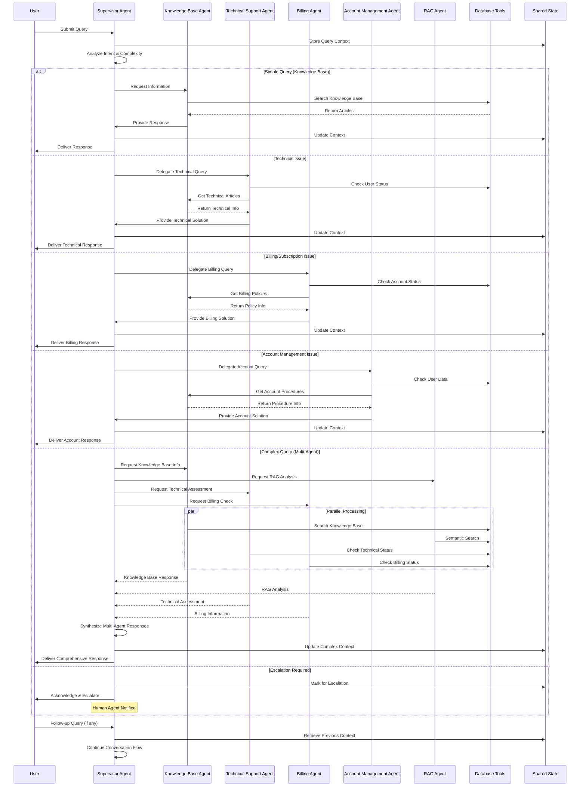
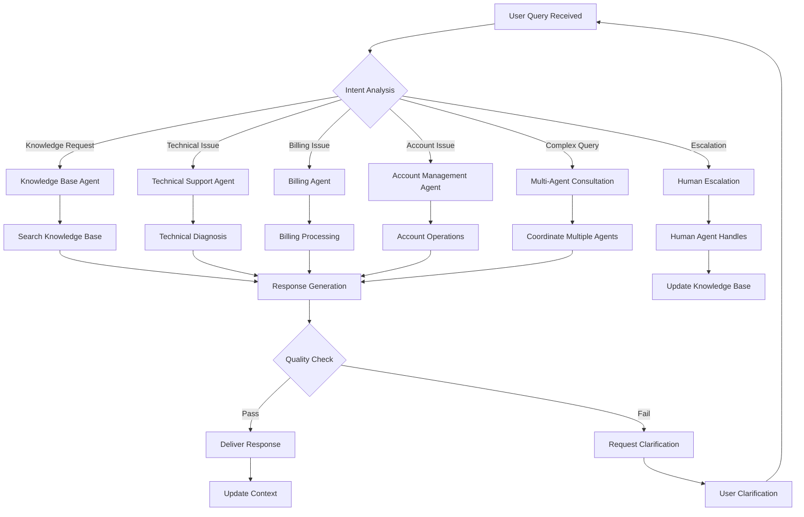
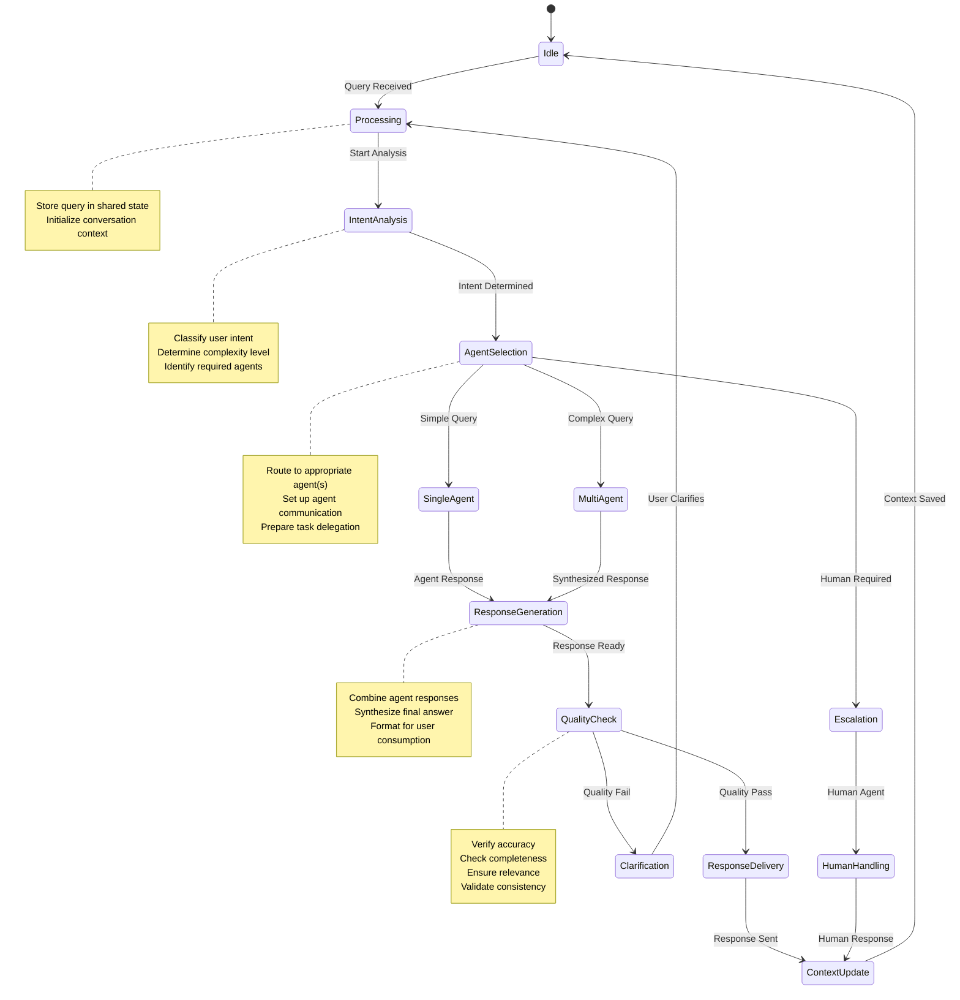
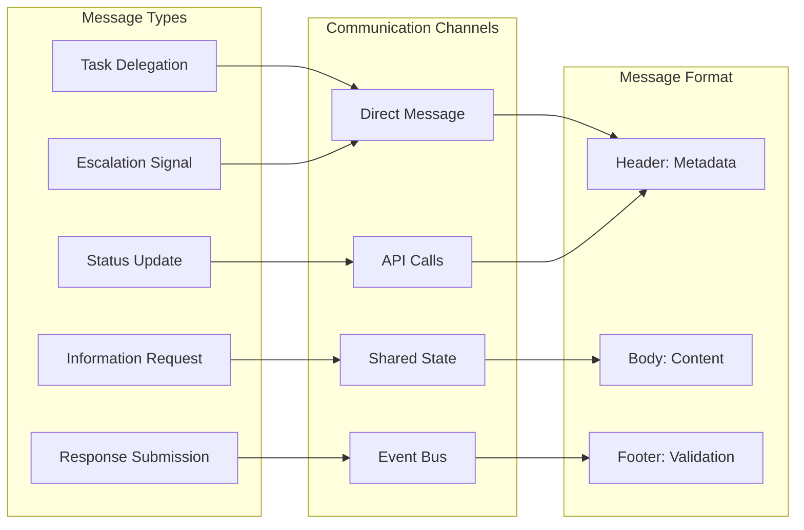
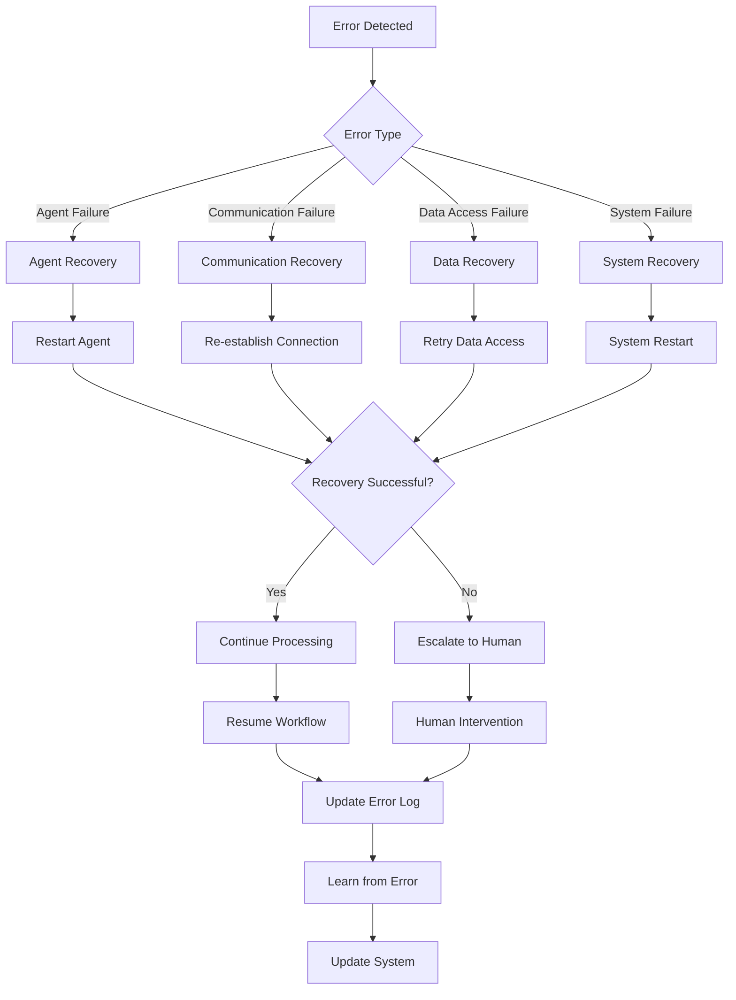
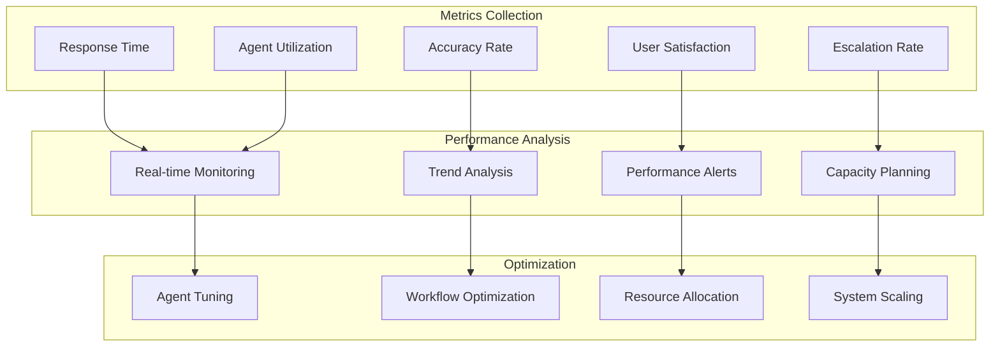
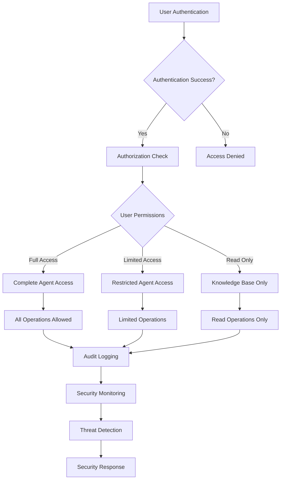

# Multi-Agent Workflow Diagram

## Detailed Agent Interaction Flow

## Agent Decision Tree

## State Management Flow

## Agent Communication Protocol

## Error Handling and Recovery

## Performance Monitoring

## Security and Access Control

This comprehensive workflow documentation provides detailed insights into how the multi-agent system operates, communicates, and handles various scenarios. The diagrams show the flow of information, decision-making processes, and system interactions at multiple levels.
